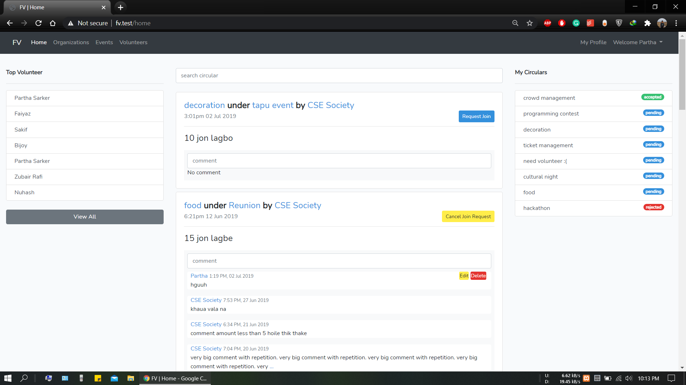
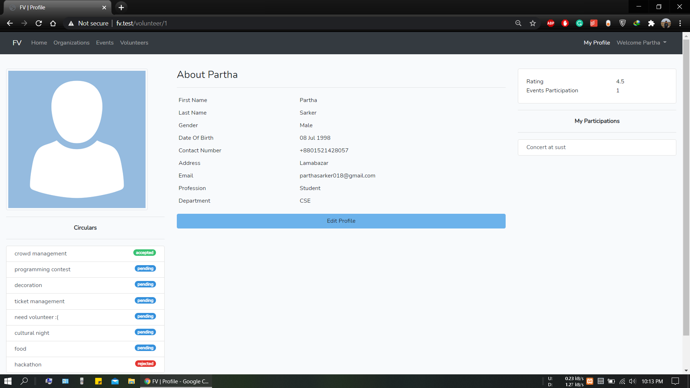
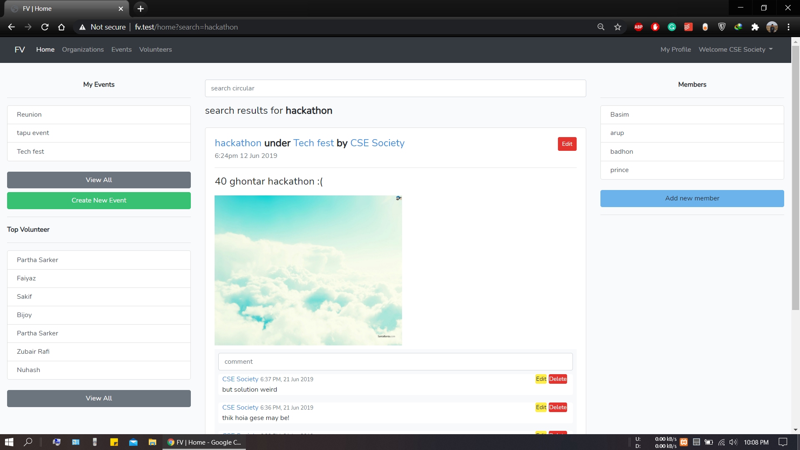
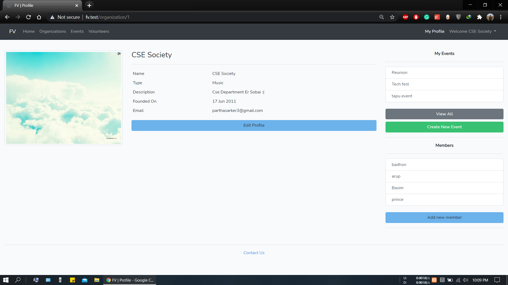
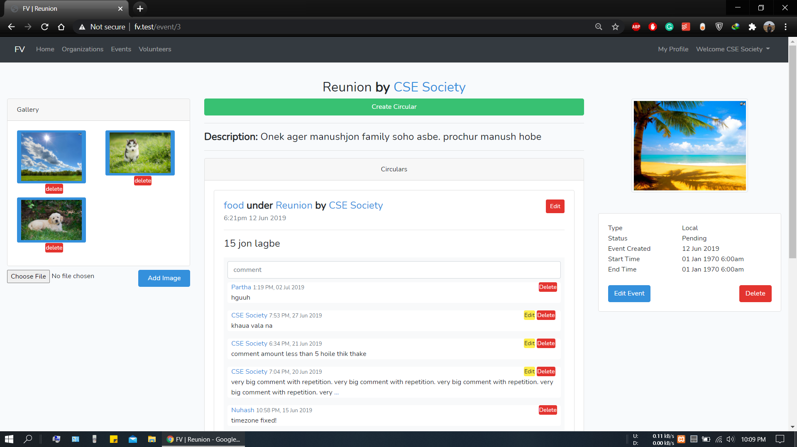
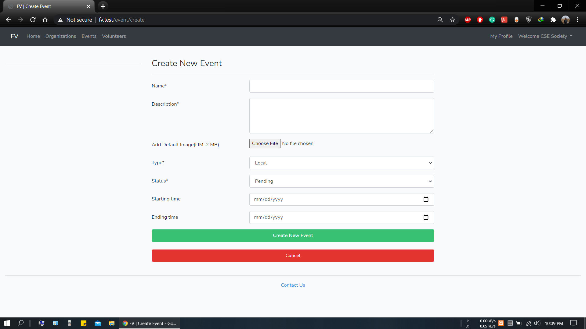
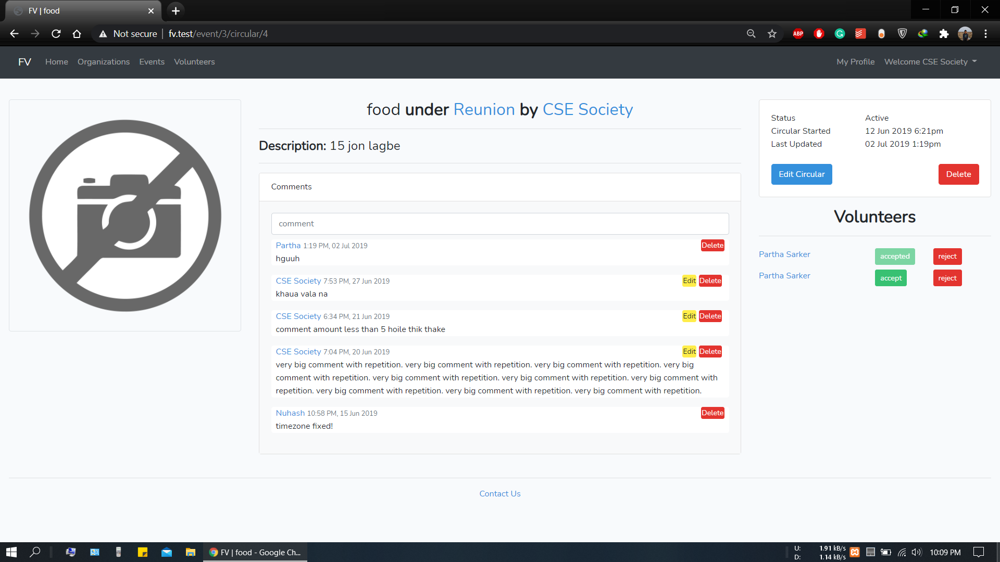
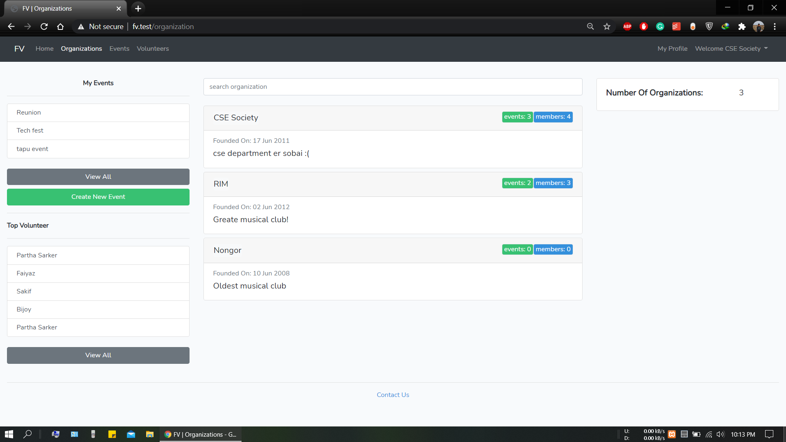
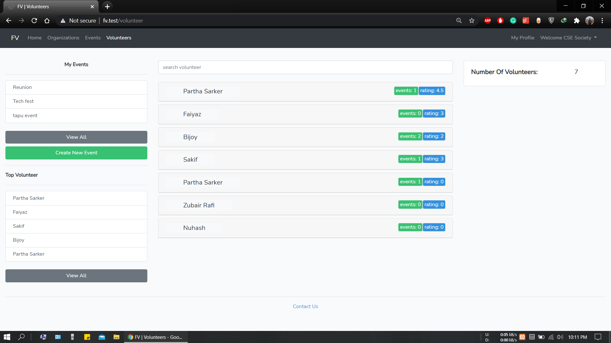
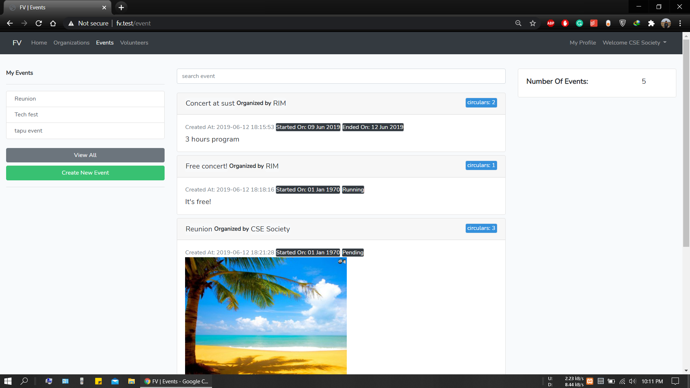

# Find Volunteer
Find Volunteer is a web project built with Laravel. This is a platform for the enthusiastic peoples of SUST and its organization. The main motive here is to bring people together and help each other.  
With our website, any organization of this university can call upon people who are willing to work on that particular field. Also volunteers who want to help organizations on their field of interest can search for events that are being organized.  
One just need to open an account as an organization or a volunteer and explore this wonderful platform of bringing earnest and committed people together.

## Functionality
-  Organizations and volunteers both need to open accounts in this website to further improve their respective activities.
-  Organizations can create, delete and edit events.
-  Organizations can post circulars under events to bring in volunteers in that particular event.
-  One can know about the respective committee of an organization if provided.
-  Volunteers can request in a circular to work in that particular event.
-  Organizations can either accept or reject any request made on their event circular by any volunteer.
-  Organizations can rate volunteers who have worked for them in any of their events.
-  Organizations can make photo galleries of their events.

## Versions
-  Laravel 5.8

# Screenshots

Volunteern home page.

Volunteer profile.

Organization home page.

Organization home page_2.

Organization profile.

An event.

Create event.

A circular

All organizations

All volunteers.

All events.

